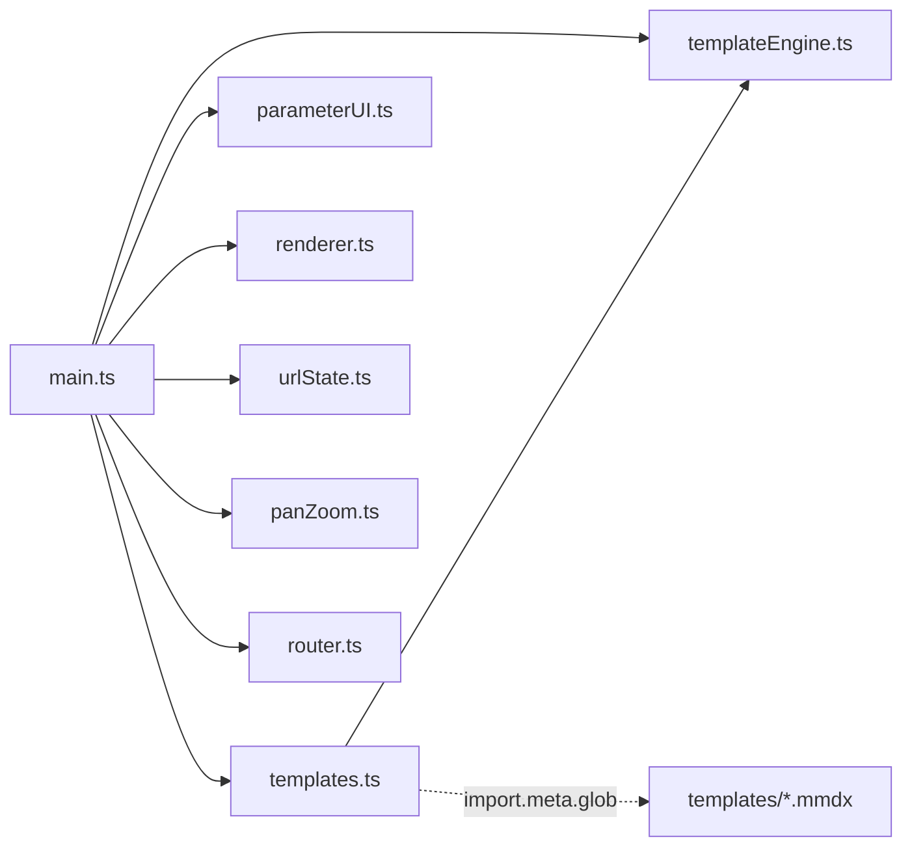
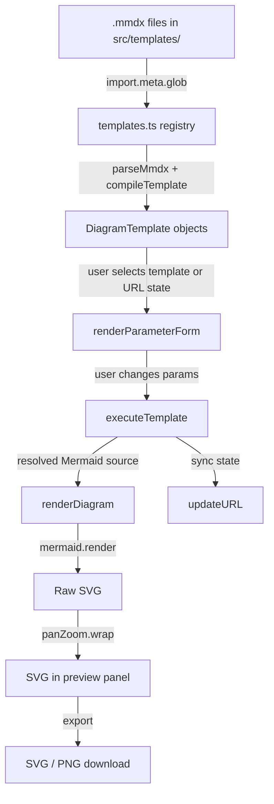

# Architecture Overview

Parametric Diagrams is a client-side application built with Vite, TypeScript, Handlebars, and Mermaid.js. There is no backend -- everything runs in the browser.

## Module Dependency

## Data Flow

## Modules

### `src/templates.ts` -- Template Registry

Discovers and loads all `.mmdx` files at build time using Vite's `import.meta.glob`. Each file is parsed and compiled into a `DiagramTemplate` object containing the name, raw template, compiled Handlebars delegate, and parameter definitions.

### `src/templateEngine.ts` -- Parser & Compiler

Core template processing:
- `parseMmdx()` -- Splits `.mmdx` raw content into frontmatter metadata and template body
- `compileTemplate()` -- Compiles Handlebars source with caching (Map-based)
- `executeTemplate()` -- Runs compiled template with parameter context, cleans up blank lines

### `src/parameterUI.ts` -- Form Generation

Dynamically generates form controls from parameter definitions:
- Boolean parameters get toggle switches
- String parameters get text inputs
- Number parameters get number inputs with optional min/max
- Fires `onChange` callback on every input change for live updates

### `src/renderer.ts` -- Diagram Rendering & Export

Handles Mermaid rendering and diagram export:
- `renderDiagram()` -- Renders Mermaid source to SVG in a container element
- `getSvgContent()` -- Serializes rendered SVG to string
- `exportAsPng()` -- Converts SVG to PNG via canvas at 2x resolution

### `src/urlState.ts` -- URL State Sync

Reads and writes application state to/from URL query parameters:
- `getStateFromURL()` -- Parses the current URL for a `template` key and parameter overrides, coercing values to the correct types based on parameter definitions
- `updateURL()` -- Writes the current template key and parameter values to the URL via `history.replaceState` (no page reload)

### `src/panZoom.ts` -- Pan & Zoom Controller

`PanZoomController` class providing interactive diagram navigation:
- Click-and-drag panning
- Ctrl+wheel zoom centered on cursor
- Touch pinch-to-zoom with midpoint tracking
- Zoom controls UI (+ / − / Reset buttons with percentage label)
- SVG wrapping via `wrap()` -- called after each render to apply CSS transforms

Scale range: 0.1x–5x. Factory function: `createPanZoom(container)`.

### `src/router.ts` -- Client-Side Router

Simple SPA router for navbar navigation between pages. Maps `data-route` attributes on `<a>` elements to page visibility:
- `/` → `#page-diagrams`
- `/about` → `#page-about`

The docs link (`data-docs` attribute) navigates externally to the VitePress site, handled separately to prevent query parameter leakage from the main app. Supports `history.pushState` for clean URLs, `popstate` for browser back/forward, and GitHub Pages 404 redirect recovery via a `?route=` query parameter.

### `src/main.ts` -- Application Entry Point

Wires everything together: calls `initRouter()` for page navigation, creates a `PanZoomController` for the diagram preview, populates the template dropdown, handles selection changes, connects parameter form callbacks to the render pipeline, sets up export button handlers, and restores state from URL query parameters on startup.
