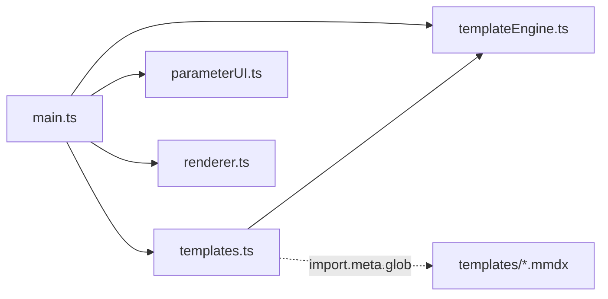
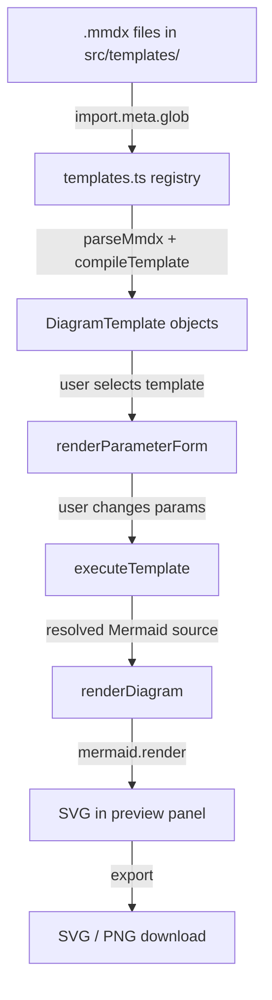

# Architecture Overview

Parametric Diagrams is a client-side application built with Vite, TypeScript, Handlebars, and Mermaid.js. There is no backend -- everything runs in the browser.

## Module Dependency

## Data Flow

## Modules

### `src/templates.ts` -- Template Registry

Discovers and loads all `.mmdx` files at build time using Vite's `import.meta.glob`. Each file is parsed and compiled into a `DiagramTemplate` object containing the name, raw template, compiled Handlebars delegate, and parameter definitions.

### `src/templateEngine.ts` -- Parser & Compiler

Core template processing:
- `parseMmdx()` -- Splits `.mmdx` raw content into frontmatter metadata and template body
- `compileTemplate()` -- Compiles Handlebars source with caching (Map-based)
- `executeTemplate()` -- Runs compiled template with parameter context, cleans up blank lines

### `src/parameterUI.ts` -- Form Generation

Dynamically generates form controls from parameter definitions:
- Boolean parameters get toggle switches
- String parameters get text inputs
- Number parameters get number inputs with optional min/max
- Fires `onChange` callback on every input change for live updates

### `src/renderer.ts` -- Diagram Rendering & Export

Handles Mermaid rendering and diagram export:
- `renderDiagram()` -- Renders Mermaid source to SVG in a container element
- `getSvgContent()` -- Serializes rendered SVG to string
- `exportAsPng()` -- Converts SVG to PNG via canvas at 2x resolution

### `src/main.ts` -- Application Entry Point

Wires everything together: populates the template dropdown, handles selection changes, connects parameter form callbacks to the render pipeline, and sets up export button handlers.
