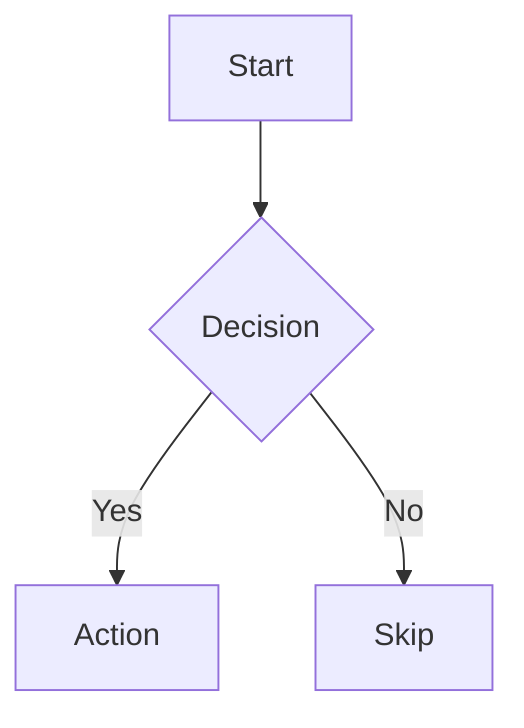
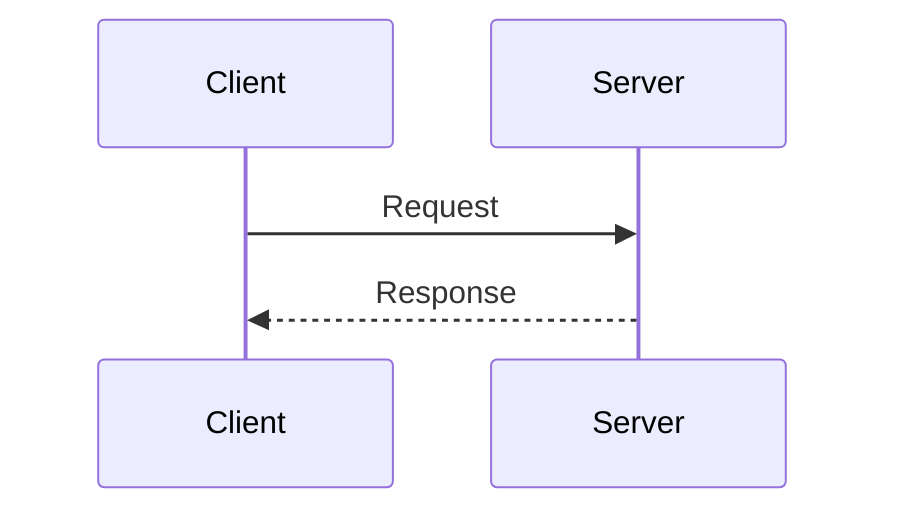

# Mermaid Diagram Types

Parametric Diagrams uses [Mermaid.js](https://mermaid.js.org/) for rendering. Any valid Mermaid diagram type works in the template body.

## Commonly Used Types

### Flowcharts

Used by most templates. Supports top-down (`TD`/`TB`) and left-right (`LR`) directions.



Key syntax:
- `graph TD` / `graph LR` -- direction declaration
- `A[Text]` -- rectangle node
- `A([Text])` -- rounded node
- `A[(Text)]` -- cylindrical (database) node
- `A{Text}` -- diamond (decision) node
- `A --> B` -- arrow connection
- `A -->|label| B` -- labeled connection
- `subgraph Title ... end` -- grouping

### Sequence Diagrams

Used by the sequence template for request/response flows.



Key syntax:
- `participant A as Label` -- declare named participant
- `A->>B: Message` -- solid arrow with message
- `A-->>B: Message` -- dashed arrow with message
- `Note over A,B: Text` -- note spanning participants

## Mermaid Configuration

The app initializes Mermaid with these settings (in `src/renderer.ts`):

```ts
mermaid.initialize({
  startOnLoad: false,
  theme: "dark",
  securityLevel: "loose",
  fontFamily: "Fira Code, monospace",
});
```

- **`theme: "dark"`** -- matches the app's dark UI
- **`securityLevel: "loose"`** -- allows click events and links in diagrams
- **`fontFamily`** -- uses Fira Code for consistent monospace rendering

See [Extending the App](/architecture/extending#mermaid-configuration) for how to customize these settings.

## Resources

- [Mermaid Syntax Reference](https://mermaid.js.org/intro/syntax-reference.html) -- All diagram types and their syntax
- [Flowcharts](https://mermaid.js.org/syntax/flowchart.html) -- `graph TD`/`graph LR` syntax
- [Sequence Diagrams](https://mermaid.js.org/syntax/sequenceDiagram.html) -- `sequenceDiagram` syntax
- [Class Diagrams](https://mermaid.js.org/syntax/classDiagram.html) -- UML class diagrams
- [State Diagrams](https://mermaid.js.org/syntax/stateDiagram.html) -- State machine diagrams
- [Entity Relationship](https://mermaid.js.org/syntax/entityRelationshipDiagram.html) -- ER diagrams
